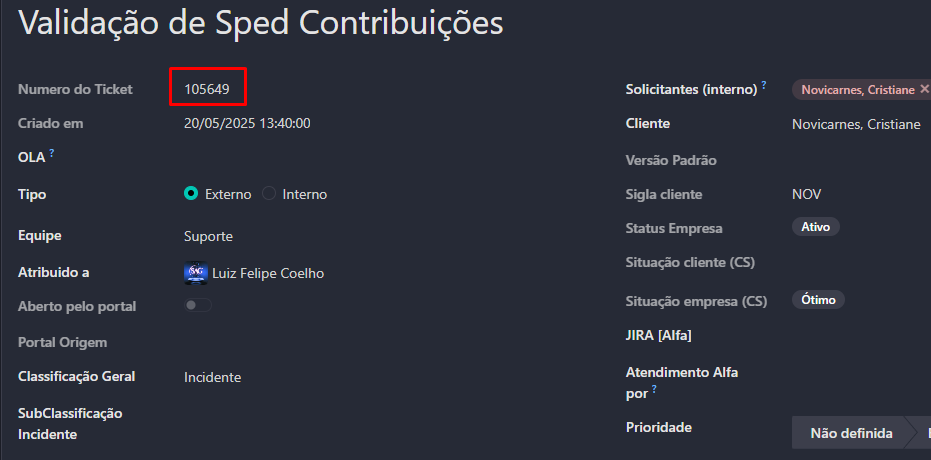
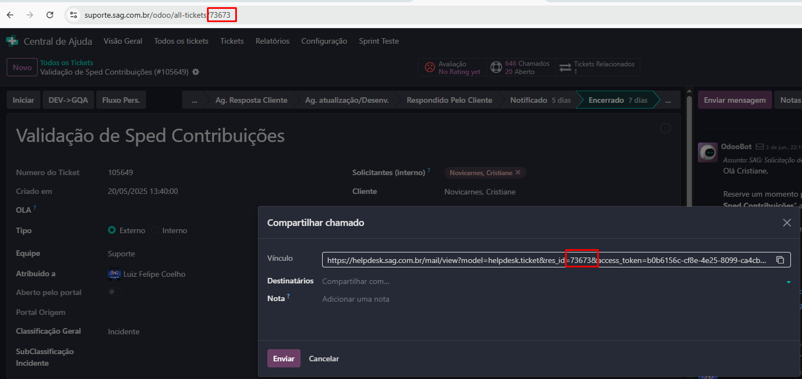

# Extensão para Facilitar a Busca de Tickets

Esta extensão foi criada para agilizar e simplificar a busca e o gerenciamento de tickets no Odoo.

## Atalhos Disponíveis

- **Ctrl + Espaço**:  
  Busca pelo número do ticket, que aparece embaixo do assunto.  
  

- **Ctrl + Alt + Espaço**:  
  Mesma coisa que Ctrl + Espaço, mas funciona no Opera também.  

- **Ctrl + Shift + Espaço**:  
  Busca pelo número do ticket que está no link.  
  

<div style="page-break-after: always;"></div>

- **Ctrl + Shift + C**:  
  Copia as informações do ticket, no padrão abaixo:

```
Ticket: Validação de Sped Contribuições (#105649)
Link: https://suporte.sag.com.br/odoo/all-tickets/73673
Solicitantes: Novicarnes, Cristiane
Cliente: Novicarnes, Cristiane
Estágio: Encerrado
Criado em: 20/05/2025 13:40:00
Atribuído a: Luiz Felipe Coelho
Prioridade: Urgente
```
- **Ctrl + Shift + M**:  
  Abre os meus tickets.

- **Ctrl + Shift + X**:  
  Abre a criação de um novo ticket (não foi usado o Ctrl + Shift + N porque já um atalho nativo dos navegadores)

- **Ctrl + F**:  
  Pesquisa os tickets por descrição, para honra e glória de quem sofre com isso

- **Ctrl + Shift + F**:  
  Busca avançada: Pesquisa no título, descrição, rotina e documentação interna/externa (usando API do Odoo).

- **Ctrl + Shift + K**:  
  Busca por Cliente: Pesquisa por Nome do Cliente, Solicitante ou Sigla.  
  > *Nota: Exclui automaticamente tickets nos estágios: Notificado, Encerrado, Cancelado/Recusado, Disponível Para Suporte.*

## Funciona para os links abaixo

- [https://suporte.sag.com.br/odoo](https://suporte.sag.com.br/odoo)
- [https://helpdesk.sag.com.br/odoo](https://helpdesk.sag.com.br/odoo)

## Como Usar

1. Copie a pasta **`odoo-ticket-extension-v2`** para sua máquina.
2. Abra seu navegador e vá na área de Extensões.
3. Ative o **Modo Desenvolvedor** nas Extensões.
4. Clique em **Carregar expandida** ou opção semelhante (pode variar de acordo com o navegador).
5. Selecione a pasta **`odoo-ticket-extension-v2`**.
6. Reinicie o navegador e seja feliz.
7. Apague a pasta do computador.